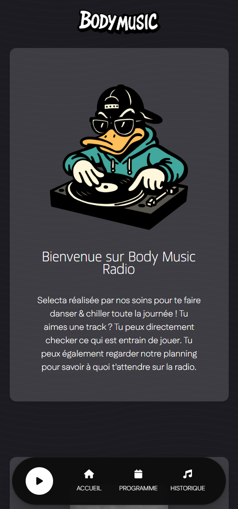
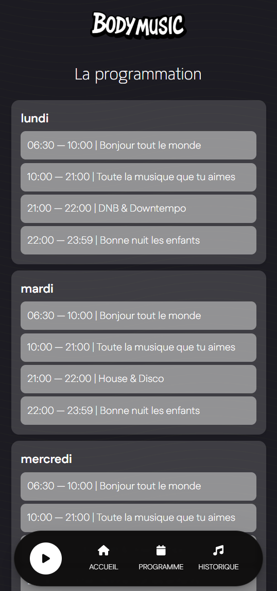
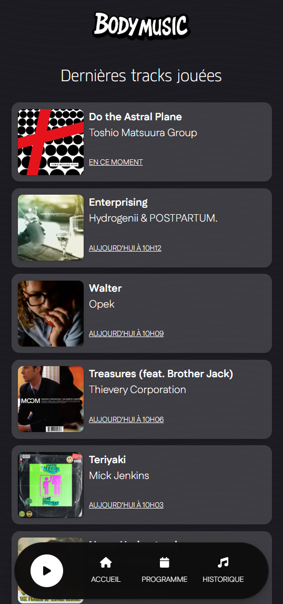

# Body Music Radio

Body Music Radio is a lightweight Vue 3 + Vite web app for streaming our online radio, discovering the current/previously played tracks, browsing our schedule, and showcasing our favorite albums. It’s optimized for mobile and ships as a PWA for install-on-device.

  

## Features
- Streaming audio player (Howler) with Media Session integration (lock screen controls)
- Mobile-first UI with persistent bottom player and quick navigation
- “Now playing” and recent track history from the radio API
- Weekly schedule loaded from a JSON file
- Albums page powered by a Google Sheet via OpenSheet
- PWA: installable, offline-ready shell, proper icons and theme

## Tech Stack
- Framework: `Vue 3`, `vue-router`, Vite
- Audio: `howler`
- UI: Font Awesome, custom CSS
- PWA: `vite-plugin-pwa`
- Deploy: Netlify (SPA redirect)

## External Data Sources
- Stream: `https://radio.niprobin.com/listen/body_music_radio/body-radio-256`
- Now playing/history: `https://radio.niprobin.com/api/nowplaying/1`
- Albums and “album du moment” (OpenSheet):
  - `https://opensheet.elk.sh/1gHxDBsWpkbOQ-exCD6iIC-uJS3JMjVmfFLvM8UO93qc/data_albums`

## Suggestions & Improvements
- UX/Content
  - Fix minor accent/encoding issues in UI strings (e.g., “Écoute”, “Écouter”).
  - Add a mini now-playing ticker in the header or player.
  - Add an “About” page with station details and contact/links.
- Performance
  - Code-split pages with lazy-loaded routes.
  - Add image optimizations (sizes/srcset) for album/cover art.
  - Fine-tune PWA caching: precache static assets; runtime cache API calls with stale-while-revalidate.
- Reliability
  - Add graceful fallbacks and retry/backoff for external APIs.
  - Validate `public/schedule.json` structure and highlight parsing errors in dev.
- Accessibility
  - Ensure proper focus states, ARIA labels, and color contrast; improve keyboard support for the volume bar.
- Internationalization
  - Extract UI strings and enable i18n for FR/EN.
- Code & Tooling
  - Remove unused deps from `package.json` (`express`, `socket.io`, `lowdb`) since this is a pure frontend.
  - Add ESLint + Prettier and a simple CI (lint/build) on PRs.
  - Unit test critical utilities/components (e.g., schedule highlighting) with Vitest.
- Small Bugs/Polish
  - In Media Session artwork, use a valid icon path (`/browser_icon.png`).
  - Ensure consistent date formatting and timezone handling across pages.

## License
No license specified. If you plan to open-source contributions, consider adding one.
